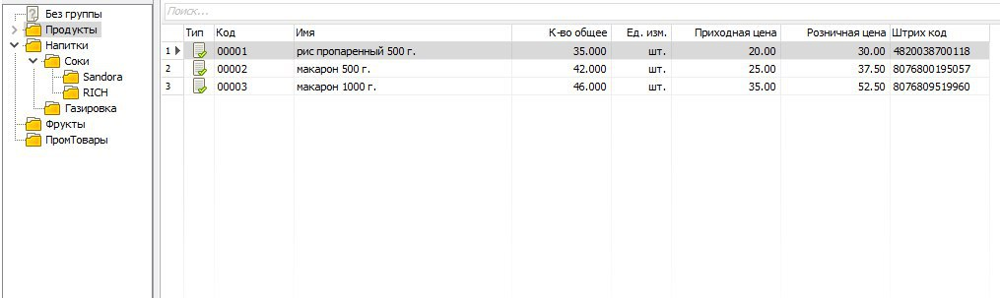

# База товарів

1. Отримати по API `https://tanuhaua.github.io/datas-file-json/store/goods.json` об'єкт з двома масивами:
    * `goods` - список товарів
    * `goodsgroups`  - список груп товарів
2. Реалізувати UI для перегляду товарів певної групи такого типу: 

3. В лівій частині екрану відображається дерево груп товарів. В правій - таблиця товарів. 
4. При кліку на певну групу справа слід показувати товари, що належать до цієї групи.
5. Якщо в товару не вказана група - його слід віднести до групи `Без группы`
6. При кліку на стрілочку `>` біля назви групи потрібно показати її підгрупи і розвернути стрілочку вниз. Якщо підгруп немає - стрілочку `>` не виводимо.

***Advanced**
1. Реалізувати сортування таблиці товарів при кліку на назву колонки.
2. Реалізувати динамічний пошук по таблиці. 